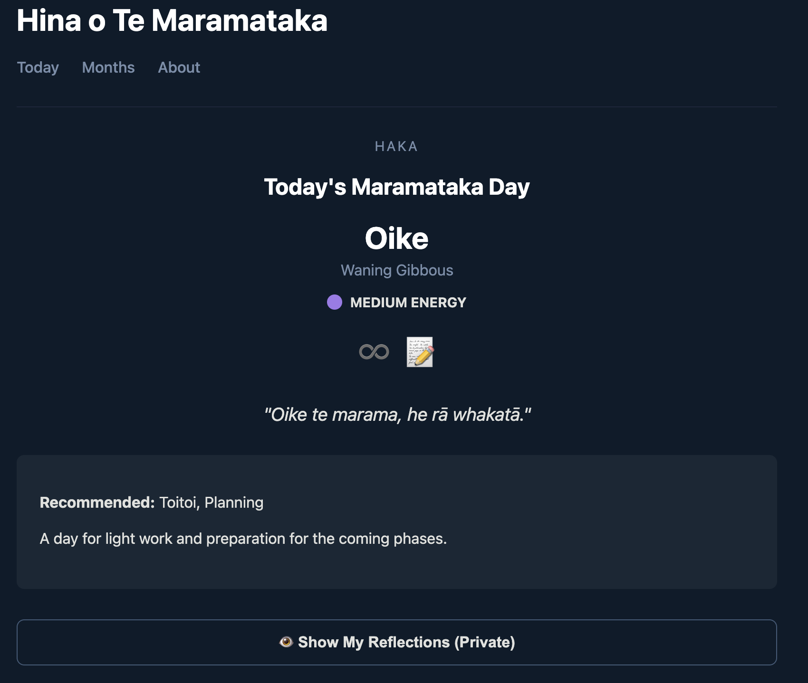

# Hina o te Maramataka

## Screenshot

## Project Overview

Hina o te Maramataka is a React + TypeScript application designed to showcase a Māori lunar calendar with contextual guidance and a personal pattern-tracking reflection section. The app maps real-world Gregorian dates to traditional maramataka phases, energy levels, and daily recommendations using a custom-built, time-aware engine.

This project is currently in the **MVP 2 Finalized phase**: the core calendar engine is complete, navigation is interactive, and personal cyclical reflections are functional.

## Features

- **Time-Aware Engine**: Automatically calculates the current lunar phase for any date between 2024 and 2026.
- **Interactive Month Grid**: A 7-column calendar view allowing users to cycle through months and deep-dive into specific phases.
- **Cultural Grounding**: Integrated guidance from sources like Dr. Hinemoa Elder’s _Wawata_, featuring energy indicators, whakataukī, and activity recommendations.
- **Private Reflections**: A secure, device-local journaling system that anchors personal notes to stable lunar slugs, enabling month-to-month pattern tracking.
- **Responsive Deep Blue UI**: A thematic, high-contrast interface designed for clarity and focus.

## Current Status

- [x] **MVP 1: Foundation**: Domain models, static data seeding, and basic dynamic lookup.
- [x] **MVP 2: Core Experience**: Routing, Interactive Month Grid, and LocalStorage Reflection persistence.
- [ ] **Data Persistence & Auth**: Transition to a proper database (SQLite/Knex) and implement secure authentication.
- [ ] **MVP 3: Advanced Insight**: Pattern visualization, data exports, and enhanced UI transitions.

## Tech Stack

- **Frontend**: React + TypeScript (TSX)
- **Routing**: React Router Dom
- **Styling**: Vanilla CSS (Custom Thematic variables)
- **Persistence**: Browser LocalStorage (Privacy-first)
- **Data Logic**: Custom Service Layer with Gregorian-to-Lunar anchoring

## Next Steps

1. **Pattern Visualization**
   - Create a view to compare reflections across multiple cycles of the same lunar day.
2. **Refine UI/UX**
   - Implement smoother transitions between routes.
   - Enhance the mobile grid responsiveness.
3. **Data Expansion**
   - Incorporate further Wawata journal prompts for all 30 phases.

---

_Note: This project is in active development. All cultural references to maramataka are for educational and personal use, informed by the cited sources in the About page. Accuracy is maintained through verified 2025/2026 anchors._
